# 面向Rust操作系统的高效动态调试机制

**——基于Asterinas的设计与实现**

| 项目 | 详情 |
|------|------|
| **队伍名称** | 儒雅的读书人 |
| **所属赛题** | proj10 |
| **成员** | 林辉 |
| **学校** | 厦门大学 |

---

## 目录

- [1. 项目背景与目标](#1-项目背景与目标)
- [2. 开发材料汇总](#2-开发材料汇总)
- [3. 系统框架设计简述](#3-系统框架设计简述)
- [4. 模块设计简述](#4-模块设计简述)
- [5. 系统测试情况](#5-系统测试情况)
- [6. 比赛过程中的重要进展](#6-比赛过程中的重要进展)
- [7. 分工和协作](#7-分工和协作)
- [8. 提交仓库目录和文件描述](#8-提交仓库目录和文件描述)
- [9. 快速开始指南](#9-快速开始指南)

---

## 1. 项目背景与目标

### 1.1 项目背景

星绽（Asterinas）OS的日志系统依赖编译期全局开关（`LOG_LEVEL` Cargo feature），调试日志开启后各模块输出混杂，开发者难以在海量信息中定位特定问题，严重制约开发迭代效率。Linux内核通过 **dynamic debug** 机制解决了这一问题——在运行时按模块、文件、函数和行号精确控制调试输出，且通过 static keys 技术确保禁用态零开销。但在 Rust 语言的安全约束下，如何在 safe Rust 为主体的代码中实现同级别的"零开销"动态调试，是一个尚未被充分探索的技术课题。

### 1.2 项目目标

| 目标 | 说明 |
|------|------|
| **功能完整性** | 四维选择器（file/module/func/line）+ last-match-wins规则链 + 运行中动态增删规则 |
| **性能零开销** | 禁用态下CPU执行NOP5穿透，与完全不存在调试代码的基线构建无统计学显著差异 |
| **编译期最大化** | linkme分布式切片 + 启动时一次性构建索引，运行时零动态分配 |
| **SMP并发安全** | 自研PatchRendezvous IPI协议 + 模块级批量修补事务 |

### 1.3 核心贡献

- **禁用态零开销**：x86_64下通过编译期预埋NOP5指令槽 + 运行时静态指令修补，禁用态热路径单指令穿透（~0.95ns/调用点），与无调试代码基线不可区分。
- **批量修补与模块门控**：模块级原子门控将多次站点级状态波动收敛为至多一次指令修补，SMP 事务次数降低 5000×、总耗时降低 24%；增量刷新（append）恒定 ~2µs 与规则链长度无关。
- **双后端跨架构自适应**：static后端（x86_64 NOP5静态修补）与branchdbg后端（纯运行时分支判断）通过条件编译自动选择，非x86架构自动回退保留全部功能。
- **自包含消融实验框架**：procfs接口支持运行时热切换修补后端与索引策略，无需重编译即可量化各优化技术的独立收益。

---

---
## 2. 开发材料汇总

### 2.1 设计及开发文档
见[开发文档](最终开发材料汇总/开发文档.pdf)

### 2.2 测试文档
见[测试文档](最终开发材料汇总/测试文档.md)

### 2.3 ppt
见[答辩ppt](最终开发材料汇总/答辩ppt.pptx)

### 2.4 演示视频
通过网盘分享的文件：项目演示视频
链接: [https://pan.baidu.com/s/1SzLmGrRGaG61T9AqdveP2g](https://pan.baidu.com/s/1SzLmGrRGaG61T9AqdveP2g) 提取码: lh77

### 2.5 AI工具使用记录
见[ai工具使用记录](最终开发材料汇总/AI工具使用记录.md)

---

## 3. 系统框架设计简述

系统整体采用**五层分层架构**，其中用户接口层、运行时过滤引擎和静态指令修补层属于运行时引擎，静态注册层和宏层属于编译时基础设施：

<p align="center">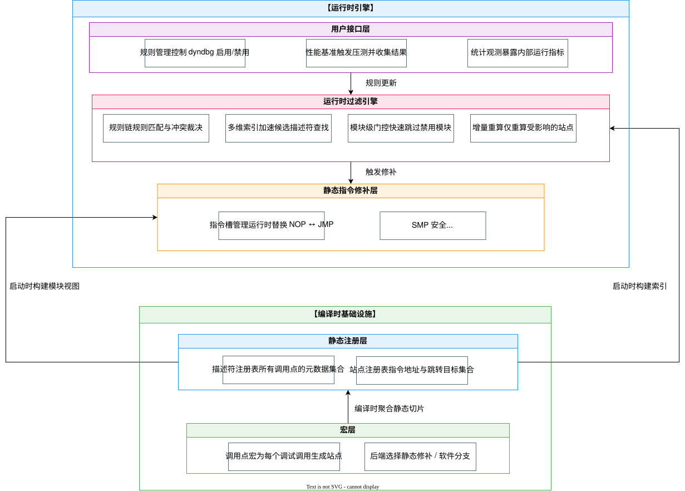</p>

| 层次 | 职责 | 核心组件 |
|------|------|----------|
| **第1层 · 用户接口** | procfs五文件虚拟接口：规则管理、统计观测、追踪观测、热点统计、性能基准 | `dynamic_debug` / `dyndbg_stats` / `dyndbg_trace` / `dyndbg_hotspots` / `dyndbg_bench` |
| **第2层 · 运行时过滤引擎** | 四维三通道索引（含段倒排）、last-match-wins规则链、增量刷新、模块门控 | `DyndbgState` 单例 |
| **第3层 · 静态指令修补** | x86_64 NOP5↔JMP rel32批量修补、SMP安全事务 | `patch.rs` + PatchRendezvous协议 |
| **第4层 · 静态注册** | linkme分布式切片聚合，启动时一次性构建索引 | `#[distributed_slice]` |
| **第5层 · 宏层** | 双后端宏系统，编译期生成描述符与5字节指令槽 | `dyndbg_debug!` 宏 |

五层之间存在两条贯穿全栈的交互链路：

- **编译时链路**：宏层为每个调用点生成描述符和NOP5槽 → 静态注册层链接时聚合为全局数组 → 启动时一次性构建索引 → 运行时引擎基于静态数据执行过滤和修补
- **运行时链路**：用户写入规则 → 过滤引擎翻译为启用/禁用决策 → 索引定位受影响描述符 → 模块门控0↔1翻转触发批量修补

<p align="center">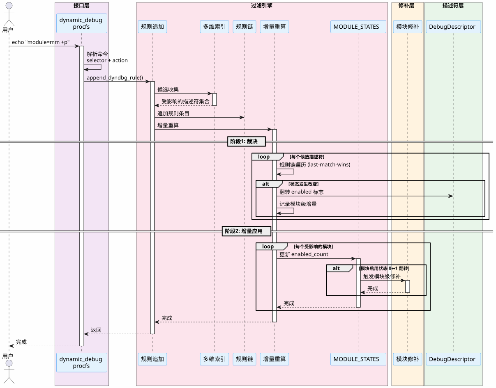</p>

---

## 4. 模块设计简述

### 4.1 用户接口层

通过 procfs 暴露五个虚拟文件，实现"读写即操作"的 shell 交互：

| 接口文件 | 功能 | 示例 |
|----------|------|------|
| `dynamic_debug` | 规则管理（追加/删除/清空）+ 状态查看 | `echo "module=ext2 file=inode.rs func=read +pfl" > .../dynamic_debug`；`cat` 查看规则链与全部调试点状态 |
| `dyndbg_stats` | 统计观测（5个AtomicU64计数器） | `cat .../dyndbg_stats` |
| `dyndbg_trace` | trace 事件快照与丢失统计（per-CPU ring） | `cat .../dyndbg_trace` |
| `dyndbg_hotspots` | 热点统计（跨CPU求和 top-10） | `cat .../dyndbg_hotspots` |
| `dyndbg_bench` | 性能基准（内核态TSC精确计时 + 消融开关） | `echo "mode=log iters=10000000" > .../dyndbg_bench` |

**规则语法**：`<selectors> <action>`（追加）、`del <id>`（删除）、`clear`（清空）。四维选择器（file/module/func/line）AND 语义，keyword 采用**三通道匹配**——完整值精确 → 段精确（module 按 `::`、file 按 `/` 切段）→ 通配符（`*`/`?`）；action 支持 `+p/-p`（log 维度）、`+trace/-trace`（trace 维度）、格式标志 `+f/+l/+m/+t`、`-f/-l/-m/-t`、`=fl` 覆盖、`+_` 清空。采用 **last-match-wins** 冲突语义——追加规则即覆盖旧决策。

### 4.2 运行时过滤引擎

核心数据结构 `DyndbgState` 包含四个关键子系统：

| 子系统 | 实现 | 作用 |
|--------|------|------|
| **四维三通道索引** | 四棵主索引 `BTreeMap`（file/module/func/line 精确键）+ 两棵段倒排索引（module 按 `::`、file 按 `/`） | 候选收集 O(k) 而非 O(n)，四维全部享受 O(log N) 精确查表（消融实测 line 2.82× ~ file 8.40×） |
| **增量刷新** | append 走增量刷新（不重跑规则链，O(k)），del/clear 走全量重放 | 实测 append 恒定 ~2µs 与规则链长度无关；增量与全量最终状态等价 |
| **模块门控** | `AtomicU32` 启用计数 + 0↔1翻转触发批量修补 | 站点级波动收敛为至多一次修补事务，SMP 事务降低 5000× |
| **Last-Match-Wins** | log/trace 双维度各自按链顺序裁决，最后命中者生效 | 追加规则自然覆盖，支持粗→细粒度收敛 |

### 4.3 静态指令修补层

x86_64上实现NOP5↔JMP rel32的SMP安全批量修补：

| 组件 | 说明 |
|------|------|
| **5字节指令槽** | 编译期预埋NOP5（`0x0F 0x1F 0x44 0x00 0x00`），启用时改写为JMP rel32（`0xE9` + 4字节偏移） |
| **PatchRendezvous协议** | ①全局排他锁 → ②IPI集结远程CPU旋转等待 → ③关CR0.WP+关中断批量写入 → ④SeqCst屏障序列化流水线 → ⑤释放远程CPU |
| **批量修补事务** | 模块级聚合：同一模块的全部站点在一次事务中完成，SMP事务次数降低 5000×（20,002,000 → 4,000），总耗时降低 24% |
| **StaticKey 通用化** | NOP5↔JMP 修补抽象为 ostd 通用 `static_key` 原语，dyndbg 与调度器追踪（sched_trace）共享同一套补丁基础设施 |

<p align="center">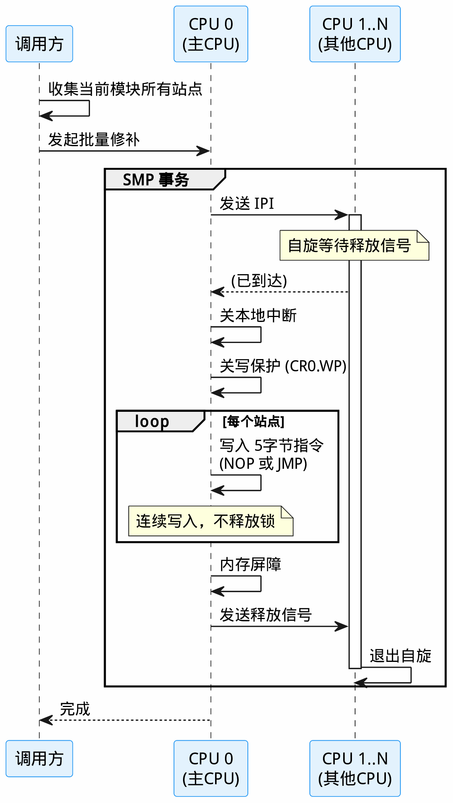</p>

### 4.4 编译期基础设施

**双后端宏系统**通过条件编译实现三路径：

| 后端 | Feature | 热路径行为 | 适用场景 |
|------|---------|-----------|----------|
| **static** | `dyndbg` | NOP5静态修补，禁用态零开销 | x86_64生产环境 |
| **branchdbg** | `branchdbg` | `if dyndbg_should_log()` 分支判断 | 非x86架构/调试构建 |
| **no-op** | 无feature | 空内联汇编，编译期完全剥离 | 无调试需求发布构建 |

所有后端共享同一套过滤引擎——切换后端仅影响热路径，用户接口和规则语义完全统一。

**linkme分布式注册**：`#[distributed_slice]` 将每个调用点的描述符、补丁站点与描述符↔站点关联（`DYNDBG_KEY_MAPPING`）分散定义到各编译单元，链接时自动合并为全局数组。启动时 `#[init_component]` 一次性遍历全局数组完成索引构建，运行中零动态分配。

<p align="center">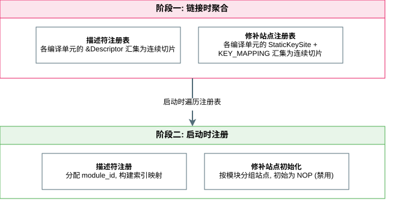</p>

<p align="center">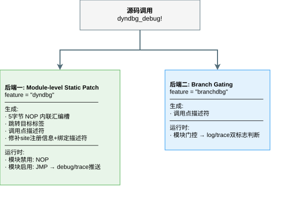</p>

### 4.5 能力扩展：轻量级 Tracepoint 与 StaticKey 通用化

**轻量级 Tracepoint**：在 NOP5 指令槽之上复用同一套补丁基础设施，实现与日志门控维度独立的追踪数据通路（`kernel/comps/logger/src/dyndbg_trace.rs`）：

| 机制 | 说明 |
|------|------|
| **per-CPU 无锁 ring** | 每个 CPU 一个环形缓冲，中断关闭下入队（避免与日志输出竞争），事件携带 CPU 归属 |
| **事件快照与丢失统计** | `dyndbg_trace` 读取各 CPU ring 事件快照与溢出丢失计数，`reset` 清零 |
| **热点排行** | `dyndbg_hotspots` 跨 CPU 求和命中次数，输出 top-10 调用点 |
| **双维度独立** | log 与 trace 维度独立裁决，`+p` 不产生 trace 事件、`+trace` 不产生日志；禁用态零额外开销 |

<p align="center">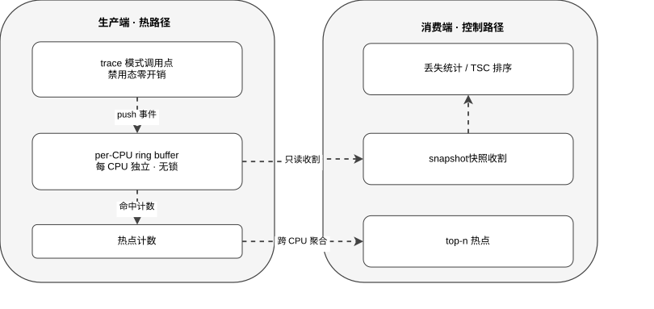</p>

**StaticKey 通用化**：NOP5↔JMP 指令修补的底层机制与"动态调试"解耦，抽象为 ostd 通用 `static_key` 原语（`static_key_branch!` 宏 + 分布式站点注册表 + 按 tag 整组启停的批量 SMP 事务），任何内核代码都能零开销使用静态分支：

| 消费者 | 用途 |
|--------|------|
| **dyndbg** | 每个调用点以 `tag="dyndbg"` 注册 StaticKeySite，模块级批量修补委托原语层 |
| **sched_trace**（调度器范例） | 独立于 dyndbg 的第二个消费者：调度器在每次上下文切换的 `pick_next_entity` 热路径上埋点，以 `tag="SCHED_TRACE"` 整组启停，展示通用性 |

<p align="center">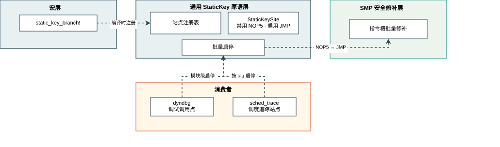</p>

### 4.6 代码组织

```
kernel/comps/logger/src/
├── aster_logger.rs          ← 核心（~2800行）：DyndbgState 规则链/三通道索引/增量刷新/模块门控、dyndbg_debug! 宏（双后端 + no-op 三路径）、描述符与 KEY_MAPPING 注册
├── dyndbg_trace.rs          ← per-CPU ring buffer + 热点计数器（trace 数据通路）
├── lib.rs                   ← crate 根，init 组件注册
└── console.rs               ← AsterLogger 实现（颜色输出）

kernel/src/fs/fs_impls/procfs/sys/kernel/
├── dynamic_debug.rs         ← /proc/sys/kernel/dynamic_debug（规则管理 + 状态查看）
├── dyndbg_stats.rs          ← /proc/sys/kernel/dyndbg_stats
├── dyndbg_trace.rs          ← /proc/sys/kernel/dyndbg_trace（事件快照/丢失统计）
├── dyndbg_hotspots.rs       ← /proc/sys/kernel/dyndbg_hotspots（热点 top-10）
├── dyndbg_bench.rs          ← /proc/sys/kernel/dyndbg_bench（基准 + backend/index/recompute 消融开关）
└── dyndbg_bench/bench_sites.rs  ← 64站点批量基准

tools/dyndbg/                ← 15个测试脚本 + 编排/收集脚本
results/                     ← 测试结果CSV（按维度分目录）
```

全部 unsafe 代码被严格限制在指令编码（5字节机器码写入）、汇编符号导出和内联汇编对齐填充三个底层操作中，上层约95%的代码为 safe Rust。

---

## 5. 系统测试情况

测试覆盖**功能正确性 → 性能 → 增量优化 → 并发可靠性**四个维度，通过 `tools/dyndbg/` 下15个shell脚本驱动，基于procfs自包含测试接口在内核内部执行，结果以CSV持久化到 `results/` 目录。

> 测试环境：Intel Core i7-10700 @ 2.90GHz（8核16线程），16GB DDR4，Ubuntu 24.04 LTS，283个调试调用点，RELEASE=1构建。

### 5.1 功能正确性（F-01 ~ F-08 + 44 扩展用例）

基础功能（F-01~F-08）验证四维选择器匹配、last-match-wins 语义、动态开关即时生效、异常输入安全处理；44 个扩展用例覆盖全部新增能力：

| 类 | 脚本 | 用例 | 验证内容 |
|----|------|------|----------|
| **格式标志** | `flags.sh` | FL-01~08 | `+f/+l/+m/+t` 前缀组合、`-f` 清除、`=fl` 覆盖、`+_` 清空、多规则累积 |
| **三通道匹配** | `match3.sh` | M-01~08 | 完整值精确/段精确/通配符三级语义、func 原子、索引 on/off 候选集等价 |
| **鲁棒性** | `robustness.sh` | R-01~06 | 非法动作/flags/del、超长命令、空命令不破坏规则链、出错后系统健康 |
| **状态查看** | `status.sh` | S-01~07 | `cat` 规则链带索引输出、+p/+trace 状态列、del/clear 状态重置 |
| **追踪与热点** | `trace.sh` | T-01-06、H-01-04 | log/trace 维度独立、ring 溢出丢失统计、per-CPU 归属、热点 top-10 与事件一致 |
| **增量等价** | `incremental.sh` | EQ-01~04 | append last-match-wins、flags-only 保持开关、增量刷新 == 全量重放 |

测试通过（F 8 + FL 8 + M 8 + R 6 + S 7 + T/H 11 + EQ 4 = 44 用例）：

<p align="center">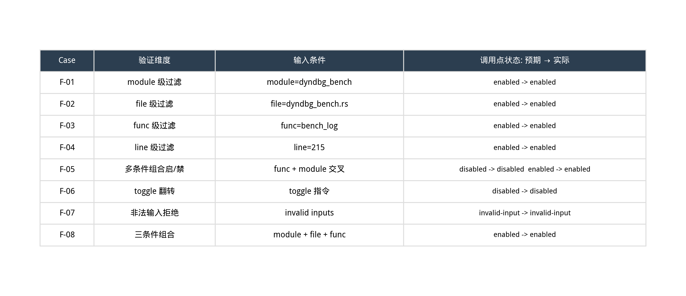</p>

**F 8 用例 + 扩展 44 用例全部通过**。关键结论：last-match-wins语义正确（追加规则自然覆盖旧决策）、动态开关即时生效（clear后立即回落disabled态）、异常输入安全处理（非法命令不改变规则链状态，不触发panic）、三通道匹配索引 on/off 候选集一致、trace 事件与热点计数一致。

### 5.2 性能测试

#### 微基准热路径对比

三种后端各1000万次迭代×50轮，内核态TSC精确计时：

<p align="center">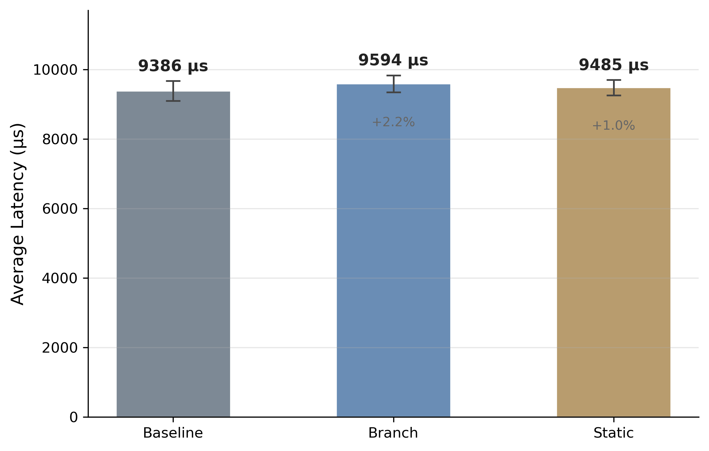</p>

| 后端 | 平均耗时 (µs) | 相对baseline增幅 |
|------|-------------|-----------------|
| baseline (no-op) | 9,386 | — |
| branch (分支) | 9,594 | +2.2% |
| static (禁用态) | 9,485 | +1.1% |

**禁用态NOP5穿透开销 ~0.95ns/调用点**，经 TOST 等价性检验（δ=0.05 ns/call，90% CI [0.0014, 0.0183]，p<0.001）确认 static 与 baseline 统计等价，达到事实上的零开销。

#### 真实工作负载

6种系统调用负载（create_delete/rename/pipe_comm等），disabled与baseline不可区分：

<p align="center">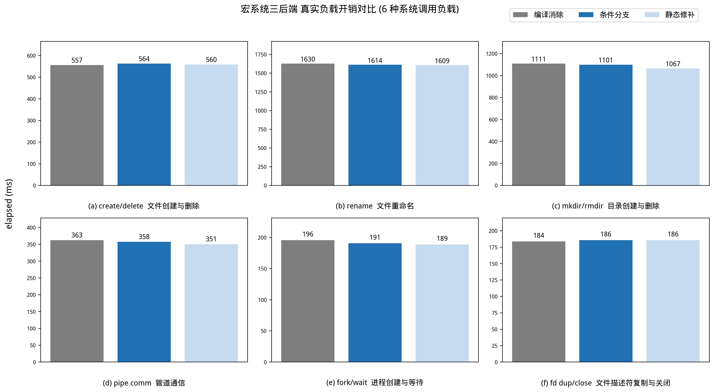</p>

全部6种负载在disabled模式下与baseline差异<2%，且 6/6 通过 TOST 等价性检验（δ=5% baseline），证明dyndbg在真实内核路径上的开销可忽略。

#### 索引加速消融实验

运行时热切换 `index=on|off`，对比四种选择器的索引加速效果：

<p align="center">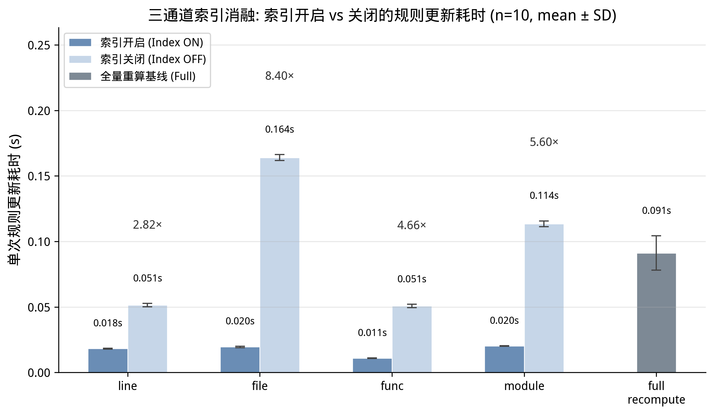</p>

| 选择器 | 加速比 | 说明 |
|--------|--------|------|
| line | **2.82×** | BTreeMap 精确键点查（O(log N)） |
| file | **8.40×** | 段精确命中段倒排索引 |
| func | 4.66× | 精确键命中返回单描述符 |
| module | **5.60×** | 完整值精确命中主索引返回整模块 |

四维全部享受索引加速；三模式分解（全量重算 L0 / 增量+扫描 L1 / 索引驱动增量 L2）显示 L2 较 L1 加速 5.6×。可扩展性实验（N=500~10,000）中精确查找类随规模线性放大：line **118×**、func **141×**、module **307×**（N=10,000），file 保持平坦 3.4-8.4×。

#### 批量修补事务对比

per_site（逐站点）vs batch（模块级批量）在相同修补负载下的SMP事务次数对比：

<p align="center">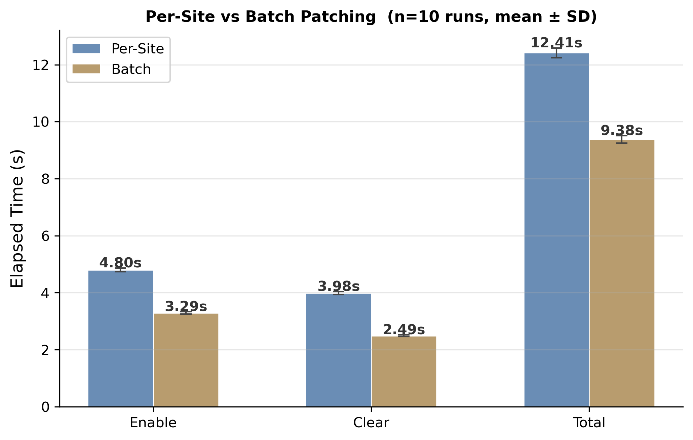</p>

| 后端 | 总耗时 (s) | SMP事务次数 | 每事务修补站点数 |
|------|-----------|------------|----------------|
| per_site | 12.41 | 20,002,000 | 1 |
| batch | 9.38 | 4,000 | 5,000 |

**SMP事务次数降低 5000×**（同一批 20,002,000 个站点修补），总耗时降低 24%；IPI广播开销与CPU核心数成正比，多核生产环境中优势更显著。

### 5.3 增量更新验证

append（增量刷新，不重跑规则链）与 del（全量重放）的更新延迟随规则链长度增长：

| 规则链长度 | append 延迟 (µs) | del 延迟 (µs) | full 基线 (µs) |
|-----------|-----------------|--------------|----------------|
| 1 | 2 | 17 | 65 |
| 100 | 2 | 1,158 | 65 |
| 1,000 | 3 | 11,749 | 65 |
| 5,000 | 2 | 58,363 | 65 |

**append 恒定 ~2µs 与链长完全无关**（O(k)，只对命中集做增量变换）；del 随链长线性增长（O(L·k)，删除改变"最后命中者"必须重放整条链）；增量刷新与全量重放的最终描述符状态完全等价（EQ-01~04 通过）。

### 5.4 并发与压力测试

| 测试 | 负载强度 | dmesg异常 | 结论 |
|------|---------|-----------|------|
| 并发开关 (C-01) | 5,000 toggle + 50,000 log并发 | 0 | 热路径与修补路径并发安全 |
| 高频压力 (C-02) | 100,000次toggle | 0 | 无内存泄漏、无锁死锁 |
| 修补风暴 (C-03) | 5进程并发×2000次风暴 + 50,000 log | 0 | 高竞争下SMP协议稳定 |

三类递增强度的并发压力测试全部通过，`dmesg_hits=0`，验证了PatchRendezvous IPI协议在多核高压场景下的正确性和稳定性。

---

## 6. 比赛过程中的重要进展

### 第一阶段：核心实现（第1-4周）

| 时间 | 里程碑 |
|------|--------|
| **第1周** (04.05) | 描述符 + 全局规则 + procfs读写接口，基础架构搭建 |
| **第2周** (04.06-11) | 四维BTreeMap索引 + 规则链last-match-wins + 增量重算 |
| **第3周** (04.13-19) | linkme分布式切片静态注册 + 内核debug宏迁移至双后端宏 |
| **第4周** (04.28) | 模块级静态修补 NOP5↔JMP 指令槽 + 模块门控 AtomicU32 计数 |

### 第二阶段：优化与测试（第5-11周）

| 时间 | 里程碑 |
|------|--------|
| **第5-6周** (05.17-18) | SMP安全修补协议 PatchRendezvous 三阶段IPI集结；批量修补事务优化；模块修补次数大幅降低 |
| **第7周** (05.25) | 10个测试脚本全面开发：功能正确性8用例、微基准+真实workload、索引消融实验、批量修补对比、并发/压力/修补风暴 |
| **第8-10周** (06.01-10) | 索引消融实验完善；延迟索引优化；collect_results结果收集框架；全部结果CSV持久化 |
| **第11周** (06.15-21) | 57页开发文档撰写；架构图/流程图制作；PPT与演示视频准备；代码清理与最终检查 |

### 第三阶段：能力扩展（第12-17周）

| 时间 | 里程碑 |
|------|--------|
| **第12-13周** (07.06-20) | 匹配引擎升级：三通道匹配（精确→段精确→通配符），四维全部索引化；输出格式 flags（+f/+l/+m/+t）与状态查看（cat 调试点状态） |
| **第14-15周** (07.21-08.02) | 增量刷新路径（append 不重跑规则链，恒定 ~2µs）；基于 NOP5 槽的轻量级 Tracepoint（per-CPU ring + 丢失/热点统计）；测试套件扩展至 15 个脚本（FL/M/R/S/T/H/EQ 44 用例） |
| **第16-17周** (08.03-12) | StaticKey 通用化（ostd 原语 + sched_trace 第二消费者）；重测全部结果数据；开发文档与测试文档全面更新（84 页 PDF） |

---

## 7. 分工和协作

| 队伍信息 | 承担工作 | 代码分布 |
|----------|----------|----------|
| 队伍名称：儒雅的读书人 | 系统架构设计与技术调研 | `kernel/comps/logger/src/` ← aster_logger crate |
| 所属赛题：proj10 | 全部代码实现（~2800行核心） | `kernel/.../procfs/sys/kernel/` ← 用户接口 |
| 成员：林辉 | shell测试套件设计执行（15 脚本） | `tools/dyndbg/` ← 测试脚本 |
| 学校：厦门大学 | 开发文档撰写；架构图/流程图制作；PPT与演示视频准备 | `开发文档/` `演示材料/` `一些开发资料/` |

完成设计、开发、测试与文档工作。

---

## 8. 提交仓库目录和文件描述

```
.
├── README.md                     ← 项目说明（本文件）
├── kernel/comps/logger/src/      ← aster_logger crate（核心实现）
│   ├── aster_logger.rs           ← dyndbg_debug! 双后端宏 + 描述符定义
│   ├── lib.rs                    ← 索引引擎、规则链、模块门控
│   ├── patch.rs                  ← NOP5↔JMP静态修补 + PatchRendezvous协议
│   ├── console.rs                ← AsterLogger log实现
│   └── dyndbg_bench/             ← 基准测试（procfs接口 + 64站点批量）
├── kernel/src/fs/fs_impls/procfs/sys/kernel/
│   ├── dynamic_debug.rs          ← procfs规则管理接口
│   ├── dyndbg_bench.rs           ← procfs性能基准接口
│   └── dyndbg_stats.rs           ← procfs统计观测接口
├── tools/dyndbg/                 ← 15个测试脚本
│   ├── run_all.sh                ← 测试编排脚本
│   ├── functional.sh             ← 功能正确性（F-01~F-08）
│   ├── flags.sh                  ← 输出格式 flags（FL-01~08）
│   ├── match3.sh                 ← 三通道匹配语义（M-01~08）
│   ├── robustness.sh             ← 异常命令鲁棒性（R-01~06）
│   ├── status.sh                 ← 状态查看（S-01~07）
│   ├── trace.sh                  ← 追踪与热点（T/H 系列）
│   ├── perf.sh                   ← 微基准性能（P-01）
│   ├── workload.sh               ← 真实负载开销（P-01R）
│   ├── index_ablation.sh         ← 索引消融实验（I-02）
│   ├── scalability.sh            ← 索引可扩展性（N=500..10000）
│   ├── patch_bench.sh            ← 批量修补对比（P-02）
│   ├── incremental.sh            ← 增量刷新链长解耦（I-03 + EQ）
│   ├── concurrency.sh            ← 并发开关（C-01）
│   ├── stress.sh                 ← 高频压力（C-02）
│   ├── patch_storm.sh            ← 修补风暴（C-03）
│   └── collect_results.sh        ← 结果聚合
├── results/                      ← 测试结果CSV（按维度分目录，scalability 按 N 分目录）
```

---

## 9. 快速开始指南

### 9.1 环境准备

```bash
# 拉取 Asterinas 开发环境 Docker 镜像
docker pull asterinas/asterinas:0.17.1-20260317

# 拉取项目代码
git clone https://github.com/LHHL7/asterinas-dyn-debug.git
```

### 9.2 启动容器

```bash
docker run -it \
  --name asterinas-dev \
  --privileged \
  --network=host \
  -v ~/asterinas-dyn-debug:/root/asterinas-dyn-debug \
  -v /dev:/dev \
  asterinas/asterinas:0.17.1-20260317
```

容器启动后进入项目目录并构建：

```bash
cd /root/asterinas-dyn-debug

# static后端（x86_64，完整静态修补能力）
make build FEATURES=dyndbg

# 启动内核
make run
```

### 9.3 使用示例

内核启动后，在 shell 中操作 procfs 接口：

```bash
# 查看所有调用点
cat /proc/sys/kernel/dynamic_debug

# 按模块启用调试日志
echo "module=ext2 +p" > /proc/sys/kernel/dynamic_debug

# 按文件+函数精确控制
echo "file=inode.rs func=read +p" > /proc/sys/kernel/dynamic_debug

# 禁用某文件
echo "file=inode.rs -p" > /proc/sys/kernel/dynamic_debug

# 查看统计
cat /proc/sys/kernel/dyndbg_stats

# 查看规则链与全部调试点状态（含 +p/+trace 状态列与格式标志）
cat /proc/sys/kernel/dynamic_debug

# 启用追踪并查看事件快照 / 热点
echo "module=dyndbg_bench +trace" > /proc/sys/kernel/dynamic_debug
cat /proc/sys/kernel/dyndbg_trace
cat /proc/sys/kernel/dyndbg_hotspots

# 输出格式前缀（函数名/行号/模块/线程ID）
echo "file=open.rs +pfl" > /proc/sys/kernel/dynamic_debug

# 运行微基准（可组合 backend/index/recompute 消融开关）
echo "mode=log iters=10000000" > /proc/sys/kernel/dyndbg_bench
cat /proc/sys/kernel/dyndbg_bench
```
