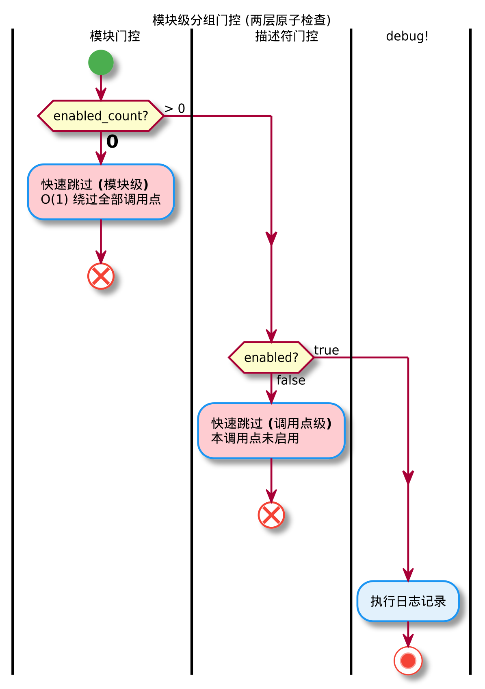
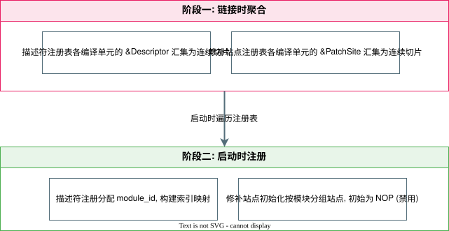
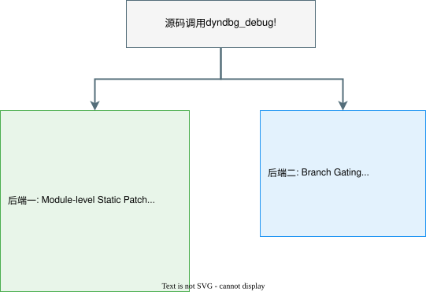

# 面向Rust操作系统的高效动态调试机制

**——基于Asterinas的设计与实现**

| 项目 | 详情 |
|------|------|
| **队伍名称** | 儒雅的读书人 |
| **所属赛题** | proj10 |
| **成员** | 林辉 |
| **学校** | 厦门大学 |

---

## 目录

- [1. 项目背景与目标](#1-项目背景与目标)
- [2. 开发材料汇总](#2-开发材料汇总)
- [3. 系统框架设计简述](#3-系统框架设计简述)
- [4. 模块设计简述](#4-模块设计简述)
- [5. 系统测试情况](#5-系统测试情况)
- [6. 比赛过程中的重要进展](#6-比赛过程中的重要进展)
- [7. 分工和协作](#7-分工和协作)
- [8. 提交仓库目录和文件描述](#8-提交仓库目录和文件描述)
- [9. 快速开始指南](#9-快速开始指南)

---

## 1. 项目背景与目标

### 1.1 项目背景

星绽（Asterinas）OS的日志系统依赖编译期全局开关（`LOG_LEVEL` Cargo feature），调试日志开启后各模块输出混杂，开发者难以在海量信息中定位特定问题，严重制约开发迭代效率。Linux内核通过 **dynamic debug** 机制解决了这一问题——在运行时按模块、文件、函数和行号精确控制调试输出，且通过 static keys 技术确保禁用态零开销。但在 Rust 语言的安全约束下，如何在 safe Rust 为主体的代码中实现同级别的"零开销"动态调试，是一个尚未被充分探索的技术课题。

### 1.2 项目目标

| 目标 | 说明 |
|------|------|
| **功能完整性** | 四维选择器（file/module/func/line）+ last-match-wins规则链 + 运行中动态增删规则 |
| **性能零开销** | 禁用态下CPU执行NOP5穿透，与完全不存在调试代码的基线构建无统计学显著差异 |
| **编译期最大化** | linkme分布式切片 + 启动时一次性构建索引，运行时零动态分配 |
| **SMP并发安全** | 自研PatchRendezvous IPI协议 + 模块级批量修补事务 |

### 1.3 核心贡献

- **禁用态零开销**：x86_64下通过编译期预埋NOP5指令槽 + 运行时静态指令修补，禁用态热路径单指令穿透（~0.95ns/调用点），与无调试代码基线不可区分。
- **批量修补与模块门控**：模块级原子门控将多次站点级状态波动收敛为至多一次指令修补，实测模块修补次数降低98.7%、更新延迟降低8.9×。
- **双后端跨架构自适应**：static后端（x86_64 NOP5静态修补）与branchdbg后端（纯运行时分支判断）通过条件编译自动选择，非x86架构自动回退保留全部功能。
- **自包含消融实验框架**：procfs接口支持运行时热切换修补后端与索引策略，无需重编译即可量化各优化技术的独立收益。

---

---
## 2. 开发材料汇总

### 2.1 设计及开发文档
见[开发文档](最终开发材料汇总/开发文档.pdf)

### 2.2 测试文档
见[测试文档](最终开发材料汇总/测试文档.md)

### 2.3 ppt
见[项目展示汇报](最终开发材料汇总/项目展示汇报.pptx)

### 2.4 演示视频
通过网盘分享的文件：项目演示视频.mp4
链接: [https://pan.baidu.com/s/1lhWoEm3SvYicdvor0rQhTg](https://pan.baidu.com/s/1lhWoEm3SvYicdvor0rQhTg) 提取码: lh77

### 2.5 AI工具使用记录
见[ai工具使用记录](最终开发材料汇总/AI工具使用记录.md)

---

## 3. 系统框架设计简述

系统整体采用**五层分层架构**，其中用户接口层、运行时过滤引擎和静态指令修补层属于运行时引擎，静态注册层和宏层属于编译时基础设施：


| 层次 | 职责 | 核心组件 |
|------|------|----------|
| **第1层 · 用户接口** | procfs三文件虚拟接口：规则管理、统计观测、性能基准 | `dynamic_debug` / `dyndbg_stats` / `dyndbg_bench` |
| **第2层 · 运行时过滤引擎** | 四维BTreeMap索引、last-match-wins规则链、增量重算、模块门控 | `DyndbgState` 单例 |
| **第3层 · 静态指令修补** | x86_64 NOP5↔JMP rel32批量修补、SMP安全事务 | `patch.rs` + PatchRendezvous协议 |
| **第4层 · 静态注册** | linkme分布式切片聚合，启动时一次性构建索引 | `#[distributed_slice]` |
| **第5层 · 宏层** | 双后端宏系统，编译期生成描述符与5字节指令槽 | `dyndbg_debug!` 宏 |

五层之间存在两条贯穿全栈的交互链路：

- **编译时链路**：宏层为每个调用点生成描述符和NOP5槽 → 静态注册层链接时聚合为全局数组 → 启动时一次性构建索引 → 运行时引擎基于静态数据执行过滤和修补
- **运行时链路**：用户写入规则 → 过滤引擎翻译为启用/禁用决策 → 索引定位受影响描述符 → 模块门控0↔1翻转触发批量修补


---

## 4. 模块设计简述

### 4.1 用户接口层

通过 procfs 暴露三个虚拟文件，实现"读写即操作"的 shell 交互：

| 接口文件 | 功能 | 示例 |
|----------|------|------|
| `dynamic_debug` | 规则管理（追加/删除/清空） | `echo "module=ext2 file=inode.rs func=read +p" > .../dynamic_debug` |
| `dyndbg_stats` | 统计观测（5个AtomicU64计数器） | `cat .../dyndbg_stats` |
| `dyndbg_bench` | 性能基准（内核态TSC精确计时） | `echo "mode=log iters=10000000" > .../dyndbg_bench` |

**规则语法**：`<selectors> +p|-p`（追加）、`del <id>`（删除）、`clear`（清空）。四维选择器支持子串匹配 + AND语义，采用 **last-match-wins** 冲突语义——追加规则即覆盖旧决策。

### 4.2 运行时过滤引擎

核心数据结构 `DyndbgState` 包含四个关键子系统：

| 子系统 | 实现 | 作用 |
|--------|------|------|
| **四维索引** | 四棵 `BTreeMap`（file/module/func/line） | 候选收集O(k)而非O(n)，file选择器显著加速 |
| **增量重算** | 仅受影响描述符子集做规则链裁决 | 避免O(n·r)全量遍历，实测重算量降低77% |
| **模块门控** | `AtomicU32` 启用计数 + 0↔1翻转触发修补 | 模块修补次数降低98.7% |
| **Last-Match-Wins** | 规则链逆序匹配，首个命中即返回 | 追加规则自然覆盖，支持粗→细粒度收敛 |



### 4.3 静态指令修补层

x86_64上实现NOP5↔JMP rel32的SMP安全批量修补：

| 组件 | 说明 |
|------|------|
| **5字节指令槽** | 编译期预埋NOP5（`0x0F 0x1F 0x44 0x00 0x00`），启用时改写为JMP rel32（`0xE9` + 4字节偏移） |
| **PatchRendezvous协议** | ①全局排他锁 → ②IPI集结远程CPU旋转等待 → ③关CR0.WP+关中断批量写入 → ④SeqCst屏障序列化流水线 → ⑤释放远程CPU |
| **批量修补事务** | 模块级聚合：同一模块的全部站点在一次事务中完成，IPI广播次数降低32.5× |


### 4.4 编译期基础设施

**双后端宏系统**通过条件编译实现三路径：

| 后端 | Feature | 热路径行为 | 适用场景 |
|------|---------|-----------|----------|
| **static** | `dyndbg` | NOP5静态修补，禁用态零开销 | x86_64生产环境 |
| **branchdbg** | `branchdbg` | `if dyndbg_should_log()` 分支判断 | 非x86架构/调试构建 |
| **no-op** | 无feature | 空内联汇编，编译期完全剥离 | 无调试需求发布构建 |

所有后端共享同一套过滤引擎——切换后端仅影响热路径，用户接口和规则语义完全统一。

**linkme分布式注册**：`#[distributed_slice]` 将每个调用点的描述符和补丁站点分散定义到各编译单元，链接时自动合并为全局数组。启动时 `#[init_component]` 一次性遍历全局数组完成索引构建，运行中零动态分配。





### 4.5 代码组织

```
kernel/comps/logger/src/
├── aster_logger.rs          ← dyndbg_debug! 宏（双后端入口 + 三路径）
├── lib.rs                   ← 模块门控、索引、规则链裁决
├── patch.rs                 ← 静态修补：NOP5↔JMP、PatchRendezvous协议
├── console.rs               ← AsterLogger 实现
└── dyndbg_bench/
    ├── mod.rs               ← procfs接口：规则解析、基准执行、统计读取
    └── bench_sites.rs       ← 64站点批量基准

kernel/src/fs/fs_impls/procfs/sys/kernel/
├── dynamic_debug.rs         ← /proc/sys/kernel/dynamic_debug
├── dyndbg_bench.rs          ← /proc/sys/kernel/dyndbg_bench
└── dyndbg_stats.rs          ← /proc/sys/kernel/dyndbg_stats

tools/dyndbg/                ← 10个测试脚本 + 编排脚本
results/                     ← 测试结果CSV
```

全部 unsafe 代码被严格限制在指令编码（5字节机器码写入）、汇编符号导出和内联汇编对齐填充三个底层操作中，上层约95%的代码为 safe Rust。

---

## 5. 系统测试情况

测试覆盖**功能正确性 → 性能 → 增量优化 → 并发可靠性**四个维度，通过 `tools/dyndbg/` 下10个shell脚本驱动，基于procfs自包含测试接口在内核内部执行，结果以CSV持久化到 `results/` 目录。

> 测试环境：Intel Core i7-10700 @ 2.90GHz（8核16线程），16GB DDR4，Ubuntu 24.04 LTS，283个调试调用点，RELEASE=1构建。

### 5.1 功能正确性（F-01 ~ F-08）

验证四维选择器匹配、last-match-wins语义、动态开关即时生效、异常输入安全处理：


**8个用例全部通过**。关键结论：last-match-wins语义正确（追加规则自然覆盖旧决策）、动态开关即时生效（clear后立即回落disabled态）、异常输入安全处理（非法命令不改变规则链状态，不触发panic）。

### 5.2 性能测试

#### 微基准热路径对比

三种后端各1000万次迭代×50轮，内核态TSC精确计时：


| 后端 | 平均耗时 (µs) | 相对baseline增幅 |
|------|-------------|-----------------|
| baseline (no-op) | 9,355 | — |
| branch (分支) | 9,625 | +2.9% |
| static (禁用态) | 9,450 | +1.0% |

**禁用态NOP5穿透开销 ~0.95ns/调用点**，与baseline差异在测量噪声边界内（1.0%），达到事实上的零开销。

#### 真实工作负载

6种系统调用负载（create_delete/rename/pipe_comm等），disabled与baseline不可区分：


全部6种负载在disabled模式下与baseline差异<2%，证明dyndbg在真实内核路径上的开销可忽略。

#### 索引加速消融实验

运行时热切换 `index=on|off`，对比四种选择器的索引加速效果：


| 选择器 | 加速比 | 说明 |
|--------|--------|------|
| line | 1.0× | 键空间稀疏，线性扫描已足够快 |
| file | **1.6×** | 键约150个，远小于描述符总数283 |
| func | 1.2× | 键约65个 |
| module | 1.2× | 候选集虽大（65描述符），索引仍有效加速 |

#### 批量修补事务对比

per_site（逐站点）vs batch（模块级批量）在相同修补负载下的SMP事务次数对比：


| 后端 | SMP事务次数 | 每事务修补站点数 |
|------|-----------|----------------|
| per_site | 130,000 | 1 |
| batch | 4,000 | 32.5 |

**SMP事务次数降低32.5×**，IPI广播开销与CPU核心数成正比，多核生产环境中优势更显著。

### 5.3 增量更新验证

| 指标 | 全量规则 (`+p`) | 模块规则 (`module=... +p`) | 缩减比例 |
|------|----------------|---------------------------|----------|
| 描述符重算量 | 283 | 65 | **77% ↓** |
| 模块修补次数 | 153 | 2 | **98.7% ↓** |
| 站点修补次数 | 283 | 65 | **77% ↓** |
| 更新延迟 (µs) | 2,469 | 276 | **8.9× 加速** |

验证了索引加速候选收集 + 模块级门控翻转机制的综合效果。

### 5.4 并发与压力测试

| 测试 | 负载强度 | dmesg异常 | 结论 |
|------|---------|-----------|------|
| 并发开关 (C-01) | 5,000 toggle + 50,000 log并发 | 0 | 热路径与修补路径并发安全 |
| 高频压力 (C-02) | 100,000次toggle | 0 | 无内存泄漏、无锁死锁 |
| 修补风暴 (C-03) | 5进程并发×2000次风暴 + 50,000 log | 0 | 高竞争下SMP协议稳定 |

三类递增强度的并发压力测试全部通过，`dmesg_hits=0`，验证了PatchRendezvous IPI协议在多核高压场景下的正确性和稳定性。

---

## 6. 比赛过程中的重要进展

### 第一阶段：核心实现（第1-4周）

| 时间 | 里程碑 |
|------|--------|
| **第1周** (04.05) | 描述符 + 全局规则 + procfs读写接口，基础架构搭建 |
| **第2周** (04.06-11) | 四维BTreeMap索引 + 规则链last-match-wins + 增量重算 |
| **第3周** (04.13-19) | linkme分布式切片静态注册 + 内核debug宏迁移至双后端宏 |
| **第4周** (04.28) | 模块级静态修补 NOP5↔JMP 指令槽 + 模块门控 AtomicU32 计数 |

### 第二阶段：优化与测试（第5-11周）

| 时间 | 里程碑 |
|------|--------|
| **第5-6周** (05.17-18) | SMP安全修补协议 PatchRendezvous 三阶段IPI集结；批量修补事务优化；模块修补次数大幅降低 |
| **第7周** (05.25) | 10个测试脚本全面开发：功能正确性8用例、微基准+真实workload、索引消融实验、批量修补对比、并发/压力/修补风暴 |
| **第8-10周** (06.01-10) | 索引消融实验完善；延迟索引优化；collect_results结果收集框架；全部结果CSV持久化 |
| **第11周** (06.15-21) | 57页开发文档撰写；架构图/流程图制作；PPT与演示视频准备；代码清理与最终检查 |

---

## 7. 分工和协作

| 队伍信息 | 承担工作 | 代码分布 |
|----------|----------|----------|
| 队伍名称：儒雅的读书人 | 系统架构设计与技术调研 | `kernel/comps/logger/src/` ← aster_logger crate |
| 所属赛题：proj10 | 全部代码实现（~1500行核心） | `kernel/.../procfs/sys/kernel/` ← 用户接口 |
| 成员：林辉 | shell测试套件设计执行 | `tools/dyndbg/` ← 测试脚本 |
| 学校：厦门大学 | 开发文档撰写；架构图/流程图制作；PPT与演示视频准备 | `开发文档/` `演示材料/` `一些开发资料/` |

完成设计、开发、测试与文档工作。

---

## 8. 提交仓库目录和文件描述

```
.
├── README.md                     ← 项目说明（本文件）
├── kernel/comps/logger/src/      ← aster_logger crate（核心实现）
│   ├── aster_logger.rs           ← dyndbg_debug! 双后端宏 + 描述符定义
│   ├── lib.rs                    ← 索引引擎、规则链、模块门控
│   ├── patch.rs                  ← NOP5↔JMP静态修补 + PatchRendezvous协议
│   ├── console.rs                ← AsterLogger log实现
│   └── dyndbg_bench/             ← 基准测试（procfs接口 + 64站点批量）
├── kernel/src/fs/fs_impls/procfs/sys/kernel/
│   ├── dynamic_debug.rs          ← procfs规则管理接口
│   ├── dyndbg_bench.rs           ← procfs性能基准接口
│   └── dyndbg_stats.rs           ← procfs统计观测接口
├── tools/dyndbg/                 ← 10个测试脚本
│   ├── run_all.sh                ← 测试编排脚本
│   ├── functional.sh             ← 功能正确性（F-01~F-08）
│   ├── perf.sh                   ← 微基准性能（P-01）
│   ├── workload.sh               ← 真实负载开销（W-01~W-06）
│   ├── index_ablation.sh         ← 索引消融实验（I-02）
│   ├── patch_bench.sh            ← 批量修补对比（P-02）
│   ├── incremental.sh            ← 增量更新验证（I-01）
│   ├── concurrency.sh            ← 并发开关（C-01）
│   ├── stress.sh                 ← 高频压力（C-02）
│   ├── patch_storm.sh            ← 修补风暴（C-03）
│   └── collect_results.sh        ← 结果聚合
├── results/                      ← 测试结果CSV
```

---

## 9. 快速开始指南

### 9.1 环境准备

```bash
# 拉取 Asterinas 开发环境 Docker 镜像
docker pull asterinas/asterinas:0.17.1-20260317

# 拉取项目代码
git clone https://github.com/LHHL7/asterinas-dyn-debug.git
```

### 9.2 启动容器

```bash
docker run -it \
  --name asterinas-dev \
  --privileged \
  --network=host \
  -v ~/asterinas-dyn-debug:/root/asterinas-dyn-debug \
  -v /dev:/dev \
  asterinas/asterinas:0.17.1-20260317
```

容器启动后进入项目目录并构建：

```bash
cd /root/asterinas-dyn-debug

# static后端（x86_64，完整静态修补能力）
make build FEATURES=dyndbg

# 启动内核
make run
```

### 9.3 使用示例

内核启动后，在 shell 中操作 procfs 接口：

```bash
# 查看所有调用点
cat /proc/sys/kernel/dynamic_debug

# 按模块启用调试日志
echo "module=ext2 +p" > /proc/sys/kernel/dynamic_debug

# 按文件+函数精确控制
echo "file=inode.rs func=read +p" > /proc/sys/kernel/dynamic_debug

# 禁用某文件
echo "file=inode.rs -p" > /proc/sys/kernel/dynamic_debug

# 查看统计
cat /proc/sys/kernel/dyndbg_stats

# 运行微基准
echo "mode=log iters=10000000" > /proc/sys/kernel/dyndbg_bench
cat /proc/sys/kernel/dyndbg_bench
```
